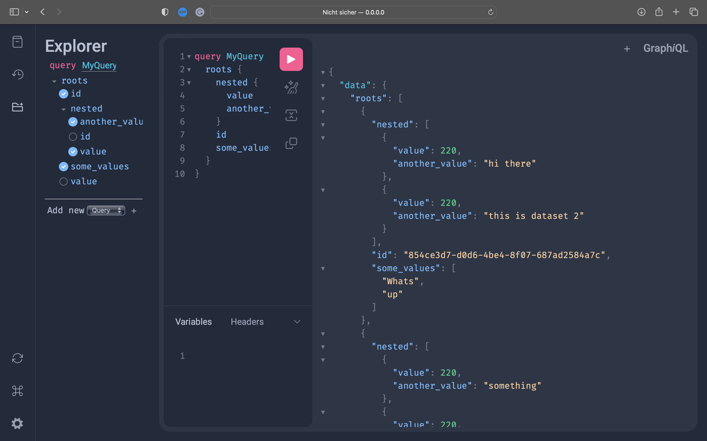

# Using GraphQL for queries

The following example demonstrates how to query the database using GraphQL. For this, we will start a server which will handle all incoming requests. The server will be started on `http://localhost:8000` and the GraphQL playground will be available on `http://localhost:8000/graphql`.

## Database setup

This example includes a `docker-compose`recipe to spawn a new instance of a MySQL database. For this, run the following command:

```bash
sudo docker-compose up --build  # Start MySQL database
python populate_db.py           # Populate database
strawberry server schema        # Run server
```

------



------
